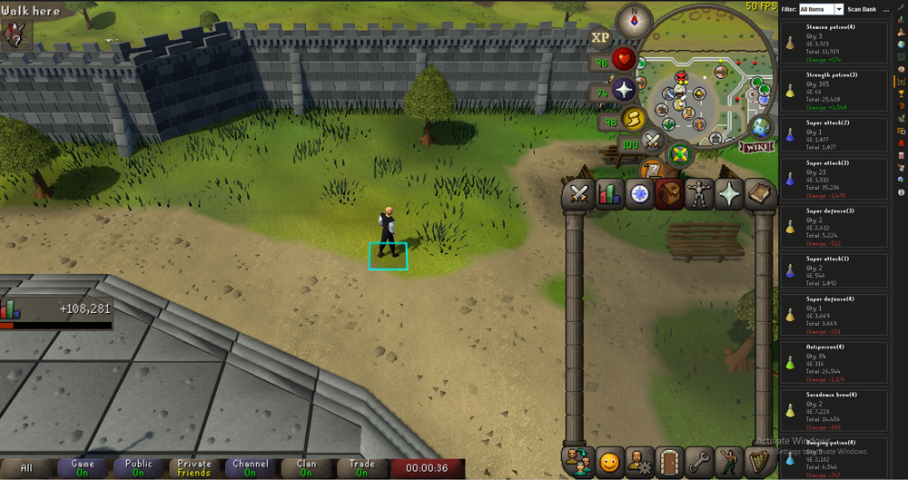
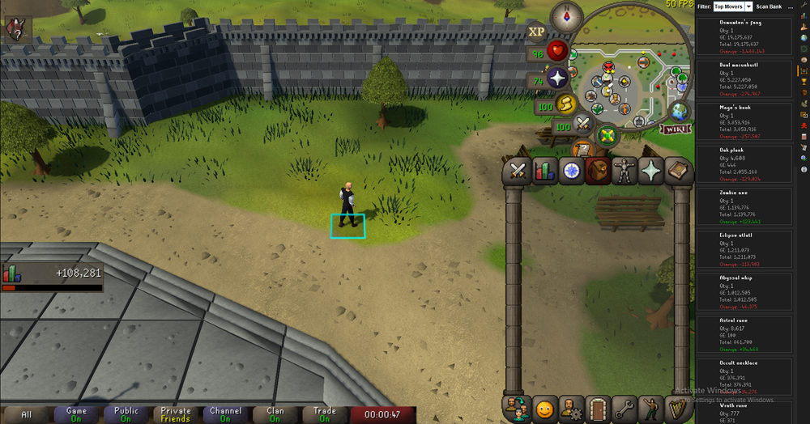
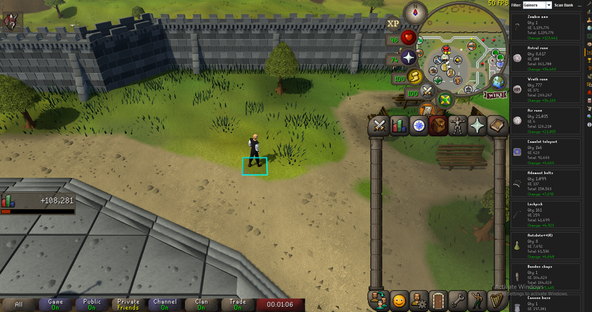
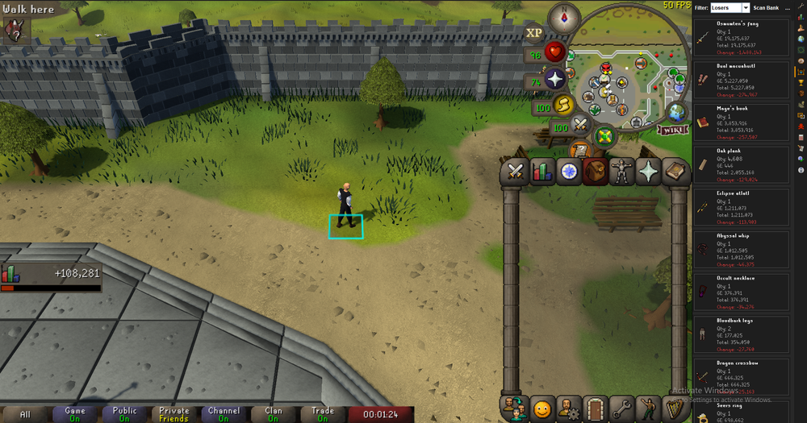

# Bank Watcher

Bank Watcher scans your bank and tracks how the value of your items changes over time. Each time you scan, it saves a snapshot of your bank, so the next scan can show you exactly which items went up or down in value since last time.

## Using Bank Watcher

Once you install Bank Watcher from the Plugin Hub, a chest with an eye icon shows up in the RuneLite sidebar. Click it to open the panel.

To run a scan:

1. Open your bank in game.
2. Click the **Scan Bank** button at the top of the panel.

The panel fills with every tradeable item in your bank. For each item you'll see its GE price, the quantity you have, the total value, and how much that total changed since your last scan. Gains show up in green, losses in red.

## Filters

Use the dropdown at the top to change what you're looking at.

**All Items** shows everything in your bank.

**Top Movers** sorts by the biggest changes in either direction, so your largest gains and losses float to the top.

**Gainers** shows only the items that went up in value since your last scan.

**Losers** shows only the items that went down.

## Good to know

**Withdrawing items shows up as a loss.** Bank Watcher compares your bank now to your bank at the last scan. If you take items out between scans, their value leaves your bank, so it reads as a drop. For example, if you have 1,000 oak logs and withdraw 500 before scanning again, the plugin sees the total value go down and marks it red. This is expected. It's tracking your bank, not where the items went.

**Deposit everything before scanning.** The scan only reads what's in your bank. Anything equipped on your character or sitting in your inventory won't be counted. If you want the scan to reflect your full wealth, bank your gear and inventory first, then scan.

**You get 5 scans per day.** To keep things reasonable, scans are limited to 5 per day. Hover over the Scan Bank button to see how many you've used. The count resets at midnight.

## Report an issue

Found a bug or have an idea? Open an issue here: https://github.com/Khaled2143/bank-watcher/issues